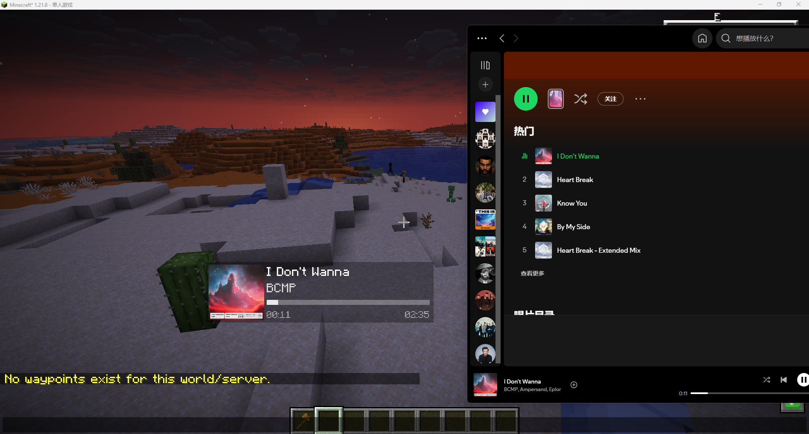

# music-integration

### Display the music currently being played by your music player that supports the Windows SMTC protocol in the client.

### This is just a proof of concept, I don't plan to continue updating it for now.

___

## Game Version: 1.21.8

## Configuration

- SMTC (Use this)
- NCM (A Chinese music player, if you don't have it don't select this)

## Dependencies
- cloth-config

## Screenshots

